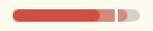

# tagwerk

[](https://aur.archlinux.org/packages/tagwerk-git)

Passive work-hours ledger for one Linux desktop running Hyprland, kitty and Omarchy. Zero manual start or stop: the timewarrior setup it replaces died of manual discipline. Two consumers: a monthly invoice and a burnout check.

| Piece        | What it does                                                                                         |
| ------------ | ---------------------------------------------------------------------------------------------------- |
| Focus poller | `tagwerk focus` as a systemd user service polls window class, title and kitty cwd                    |
| hypridle     | `tagwerk idle` and `tagwerk active` from the idle listener and around sleep                          |
| Agent hooks  | Claude Code hooks and a pi extension run `tagwerk beat` with the agent's cwd                         |
| Ledger       | `~/.local/share/tagwerk/YYYY-MM.jsonl`, append-only, UTC timestamps                                  |
| Attribution  | a present minute is split evenly across leased repos, else the ambient bucket, else `personal/other` |
| Reports      | `day`, `week`, `month`, `invoice`; `fix` appends a span                                              |
| Bar widget   | an Omarchy plugin drawing today's credited hours against the day cap, from `tagwerk day --json`      |

Documentation: [tagwerk.espadat.com](https://tagwerk.espadat.com). Vocabulary: `CONTEXT.md`. Decisions with their trade-offs: `meta/adr/`. Spec and tickets: [issue #4](https://github.com/espadat-studio/tagwerk/issues/4).

## Install

Target: Omarchy 4 with Hyprland and kitty. The [AUR package](https://aur.archlinux.org/packages/tagwerk-git) pulls `hypridle` and the system Python; tagwerk itself has no runtime dependencies (ADR-0004) and tracks master (ADR-0005).

```sh
paru -S tagwerk-git
tagwerk init && $EDITOR ~/.config/tagwerk/config.toml
systemctl --user enable --now tagwerk-idle.service tagwerk-focus.service
```

The agent hooks are part of that install, not an optional extra: without them a present minute of background agent work is credited to the focused window instead of the agent's repo. [Getting started](https://tagwerk.espadat.com/getting-started/installation/) covers the units, the hypridle choice, the kitty remote-control requirement, the agent hooks and the verification steps that prove each sensor fires.

## Configuration

Point `[roots]` at your work org's clone directory as `work` and at your personal code directory as `personal`, and make the `[[title]]` patterns match your org's GitHub titles and chat apps. [Configuration](https://tagwerk.espadat.com/configuration/) covers every key with its default, which kinds are paid and which reach the invoice, and how a rule that cannot work is rejected when the config loads.

## Omarchy bar widget

A cap-proximity cue for the bar, answering one question: am I close to the day cap, or not? A track, a fill running to today's credited minutes with the paid stretch solid inside it, and the cap as a notch you watch the fill close on. One glance, no arithmetic, nothing to read.

```sh
cp -r /usr/share/tagwerk/omarchy ~/.config/omarchy/plugins/espadat.tagwerk
omarchy-shell shell rescanPlugins
omarchy plugin enable espadat.tagwerk
```

| What you see                                                                                                                                                                                                                                      | What it is                                                                                                                                                                                                                                          |
| ------------------------------------------------------------------------------------------------------------------------------------------------------------------------------------------------------------------------------------------------- | --------------------------------------------------------------------------------------------------------------------------------------------------------------------------------------------------------------------------------------------------- |
| <picture><source media="(prefers-color-scheme: dark)" srcset=".github/assets/widget-empty-dark.png"></picture>          | An empty day. The track spans the cap times 1.25, so 10 hours across 40px at an 8-hour cap: 4px per hour, and 30 minutes is 2px. The notch is the cap, always at 80%.                                                                               |
| <picture><source media="(prefers-color-scheme: dark)" srcset=".github/assets/widget-personal-dark.png"></picture>       | 5:00 credited, none of it paid. The translucent fill is every credited minute, `total_minutes`.                                                                                                                                                     |
| <picture><source media="(prefers-color-scheme: dark)" srcset=".github/assets/widget-split-dark.png"></picture> | 7:20 credited, 5:10 of it paid. The solid stretch is `paid_minutes`; the gap between the two edges is personal.                                                                                                                                     |
| <picture><source media="(prefers-color-scheme: dark)" srcset=".github/assets/widget-atcap-dark.png"></picture>        | 8:00 credited, exactly on the cap. The fill stops flush against the notch, because the cap sits at 80% of a track that runs to 125% of it.                                                                                                          |
| <picture><source media="(prefers-color-scheme: dark)" srcset=".github/assets/widget-over-dark.png"></picture>                                 | 9:00 credited, `over_cap`. Both segments switch to the theme's urgent colour and the notch does not, so the hour past the cap stays readable: the notch is painted above the fill. There is no approaching colour — proximity is the fill's length. |

Hover prints work, personal, presence, and the time left or over. Click opens `tagwerk week` in the themed floating terminal. The widget lands on the right of the bar; `omarchy bar move espadat.tagwerk` relocates it.

It runs `tagwerk day --json` every 300 s and draws four rectangles. Nothing else: it never reads the ledger, never reads your config, and never re-implements the cap rule — `over_cap` arrives already computed (ADR-0011). Change `refreshIntervalSec` in the widget's settings; below 15 minutes the fill moves less than a pixel, so the interval buys the notch crossing and nothing more.

A copy, not a symlink: `omarchy plugin validate` refuses any symlink inside a plugin folder, so a linked install cannot be checked. The directory name must equal the manifest id, because that is how the shell maps a changed file back to its plugin. Re-copy after a `tagwerk-git` update; the shell hot-reloads the widget on the write.

## Migrating from timewarrior

```sh
tagwerk import-timew --work-tag TAG
```

`TAG` is the timewarrior tag that marked an interval as work (`timew tags` lists them); intervals without it become `personal`. `project:<repo>` tags become the project, anything else lands in `general`. The import reads `timew export` and refuses to run twice, so run it before uninstalling timew.

After a week of trusted numbers, retire the timewarrior setup:

```sh
systemctl --user disable --now bugwarrior-pull.timer tw-today-reset.timer
sudo rm /usr/lib/systemd/system-sleep/timew-stop
omarchy pkg drop timew
```

The sleep hook belongs to no package and runs `timew stop` on every suspend. Timewarrior's intervals are already in the ledger as spans. Taskwarrior stays.

## Commands

`day`, `week`, `month` and `invoice` report; `fix` appends a span; `focus`, `beat`, `idle` and `active` are the sensors; `init` and `doctor` set up and check. [CLI reference](https://tagwerk.espadat.com/cli-reference/) has every command with its flags.

## Attribution notes

- A minute is present when you are not idle and a poll landed within the last 2 minutes. Present minutes are credited exactly once, so daily totals equal wall-clock presence.
- An agent beat leases its repo for 10 minutes; a focused kitty cwd or a GitHub repo title leases for 1 minute. A leased repo is credited while an unrelated window is focused, such as a browser tab during a long Claude turn. Two leased repos split each minute evenly (ADR-0003).
- Beats while idle book nothing. An unattended overnight agent adds no hours; credit resumes on the still-valid lease when you return.
- With no lease the focused window decides. A kitty shell sitting at a root books that kind's `general`; a work-pattern title (Slack, Zoom, Meet, your org) books `work/general`; anything else books `personal/other`.
- Idle inhibitors are honoured, so a video call with your hands off the keyboard stays present. In exchange an abandoned video also stays present and books `personal/other`; that inflates the chart, never the invoice. If the chart looks inflated, copy `/usr/share/tagwerk/hypridle.conf`, set `ignore_dbus_inhibit = true` in the copy, and point hypridle's `--config` at it with `systemctl --user edit tagwerk-idle.service`.
- `work` and `fixed` are both paid: both drive the week cap and both land in the `work` subtotal. Only `work` reaches `tagwerk invoice`, so fixed-price hours show up in the burnout check and never on an hourly customer's bill (ADR-0006). The day cap measures every credited minute instead, `personal` included, because burnout does not care who paid for the hour (ADR-0011).
- A span overrides the sensors for its whole range, no partial merge, and the latest appended span wins on overlap. Nothing in the ledger is ever edited (ADR-0002).
- A renamed repo keeps one row in every report: add `"old-name" = "new-name"` under `[rename]` and the old name folds into the new one for all time, past months included. The kind is never rewritten, so minutes credited as `personal` stay personal even if the project now sits under a work root (ADR-0010).

## Known ceilings

- Poll granularity is 15 s with a 60 s re-poll. Hyprland's event socket was rejected: it cannot see `cd` inside a terminal and emits a title event per spinner frame.
- A repo whose name contains a dot is truncated at it; give it its own root, or rename the directory and add a `[rename]` entry so the old minutes follow.
- A directory that holds worktrees books every worktree under it to the container's name, because the project is the first directory below the root. Give the container its own root: the longest match then picks it, and the repo name below it becomes the project.
- A rename keys on the project name, not the path, so one entry reaches spans and window titles as well as cwds. In exchange two repos sharing a name under different roots fold together, and a rename is single-hop: renaming twice means pointing both old names at the current one.
- Colours come from five hues that pass the contrast check; past a handful of work repos two will share one.
- Spans written before `ts` carried microseconds resolve by file order when two of them share a second across month files; their append order was never recorded, so no rewrite can fix it (ADR-0009).
- Reports rescan the month files on every run; a month is about 43k minutes and a few thousand events, fine for years of data.
- `doctor` cannot tell a sensor that is deliberately unwired from one that broke, so a machine that runs no agents reports `beat` dark for good. Raise `sensor_dark_h` or read past that row.
- `doctor` judges a root by whether it is a directory right now, so a root on an unmounted drive reads `suspect` until you mount it. It costs a row and exit 3, never a number in a report.
- `doctor` tests each `[[title]]` pattern against every title on its own, so a pattern permanently shadowed by an earlier one still reads clear. Attribution takes the first match, and replaying that order across the whole ledger would cost more than the typo it would catch.
- Exit 2 is shared: argparse spends it on a usage error, so `tagwerk doctor --bogus` alarms a prompt exactly as a dark sensor does.
- `day --json` judges `over_cap` on the whole minutes it prints, while the `week` bar reddens on the raw total. A day landing within half a minute of the cap can read over in one and under in the other; self-consistent JSON was worth more than agreement at that boundary.
- The bar widget notches the day cap alone. `week_cap_h` is arguably the better burnout signal, but `--json` is `day` alone, so a 38-hour week reads quiet there on Friday morning.
- The widget redraws on a timer, so it trails the true minute by up to `refreshIntervalSec` — 300 s by default, which is a fifth of a pixel of fill.
- One machine, no web UI, no sync, no notifications. `--json` is `day` alone; every other report is text for a human to read.

## Development

```sh
mise install
hk install --mise
mise run check
mise run test
```

`check` runs dprint and ruff; `test` runs pytest, then mypy strict. Tests drive the CLI with `TAGWERK_CONFIG` and `TAGWERK_DATA_DIR` pointed at a temp directory and fake `hyprctl` and `kitten` executables on `PATH`; they never touch the real ledger.

`contrib/aur/` holds the PKGBUILD. A push to master that touches it publishes `tagwerk-git` to the AUR; code changes reach users through `paru -Syu --devel` with no publish. The package builds master, so a renamed `contrib` file and its PKGBUILD line ship in the same PR. `makepkg -f --nodeps` inside `contrib/aur` builds it locally.
